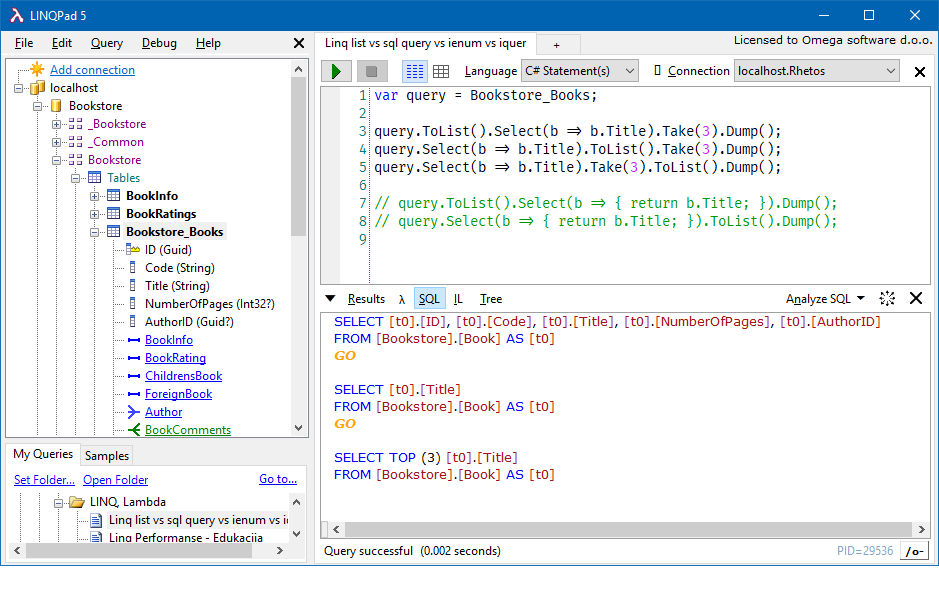

# Day 1

Topics:

1. [Prerequisites for day 1](#prerequisites-for-day-1)
2. [What is Rhetos](#what-is-rhetos)
3. [What is available on GitHub](#what-is-available-on-github)
4. [Development environment setup and the first application](#development-environment-setup-and-the-first-application)
5. [Rhetos DSL syntax](#rhetos-dsl-syntax)
6. [Data model and relationships](#data-model-and-relationships)
7. [From LINQ to SQL](#from-linq-to-sql)

## Prerequisites for day 1

Assignment:

1. Follow the steps in the Prerequisites article (<https://github.com/Rhetos/Rhetos/wiki/Prerequisites>)
   to make sure that you have all the application development tools needed for this workshop.
   * Make sure to install IntelliSense support for Rhetos DSL.

## What is Rhetos

An overview of the Rhetos development platform, what is it intended for and how to use it.

Documentation:

* <https://github.com/Rhetos/Rhetos/wiki/What-is-Rhetos>

Contents:

* Why Rhetos
  * Domain-Specific Programming Language for Enterprise Application Development
  * Business logic layer & Data access layer (without frontend)
  * Quick-start, Standardization, Maintainability
* Contents of the Rhetos platform
* Domain-Specific Language
  * Declarative programming
  * Concepts, statements and code generators
  * Metaprogramming
* Example
  * Why is InvalidData separated from ItemFilter?
  * The validation is context-free (can be applied on the old data after a bug is fix).
  * AutoCode seems simple, but contains a lot of optimization and concurrency control.
    Standardization and simple reuse of these features are great benefits.
* Deployment

## What is available on GitHub

Overview of the available source, documentation and the support on GitHub.

Documentation:

* For a quick overview see the Sidebar box at <https://github.com/Rhetos/Rhetos/wiki>.

Contents:

* What is Rhetos, Roadmap, How to Contribute
* Tutorials and samples, Recommended plugins, Support - Questions and Issues, Release notes
* GitHub issues list serves as a FAQ. Create a new issue to ask a question (New issue → Question).
  Feel free to include the error message or exception call stack in the question,
  after removing any personal data.

Assignment:

1. Create an account at `rhetos-dev` Slack team (<https://rhetos-dev.slack.com/signup>)
   and join the channel `#workshop` (English) or `#radionica` (Croatian),
   where we can discuss daily issues and answer questions related to this workshop.

## Development environment setup and the first application

Step-by-step development of a "hello world" application on the Rhetos platform.

Documentation:

* <https://github.com/Rhetos/Rhetos/wiki/Creating-new-WCF-Rhetos-application>
* <https://github.com/Rhetos/Rhetos/wiki/Prerequisites>

Contents:

* Note:
  Tutorials in this workshop are based on the demo application that will be created here
  (a bookstore management application).
  We will add new features to this application as we cover mode topics in the future.
* Create a "Hello world" application (**Bookstore**) by following the step-by-step instruction from
  [Creating a new WCF application with Rhetos framework](https://github.com/Rhetos/Rhetos/wiki/Creating-new-WCF-Rhetos-application).
  * Development environment setup (assignment before day 1)
  * Create a new application in Visual Studio
  * Set up the database and user authentication
  * Write a simple DSL script
  * Build your application
  * Test and review the application
    * **Demonstrate** and review the generated database and web API.
  * Publishing the application to a test environment or production
    * Read this section, but there is no need to publish to a new test environment for this tutorial.
  * A more complex project structure
    * You can **skip** this section for now.

## Rhetos DSL syntax

Grammar for Rhetos DSL. Basic principles for writing the DSL scripts.

Documentation:

* <https://github.com/Rhetos/Rhetos/wiki/Rhetos-DSL-syntax>

Contents:

* Declarative programming: Irrelevant order of lines, or organization of scripts.
* Concept, statement.
* Syntax: Literals (string, reference), Quotes.
* Nested vs flat statements.

Assignment:

1. Read the article <https://github.com/Rhetos/Rhetos/wiki/Rhetos-DSL-syntax>
2. Rewrite all the statements from the short DSL script example from article
   [Creating a new WCF application with Rhetos framework](https://github.com/Rhetos/Rhetos/wiki/Creating-new-WCF-Rhetos-application#write-a-simple-dsl-script)
   to be written in "flat" format, without nested statements.
   * Use the "nested" format in future development.
     The "flat" format is rarely used in practice, but this exercise helps
     to understand how Rhetos looks at the statements in DSL scripts.

## Data model and relationships

How to implement the data structure when developing a business application on the Rhetos platform.
Entity model, property types and relations.

Documentation:

* <https://github.com/Rhetos/Rhetos/wiki/Data-model-and-relationships>

Contents:

* **Demonstrate** the following DSL script examples from the wiki article:
* Entities and properties
  * Review the generated table in database.
* One-to-many relationship (Reference, Detail)
  * Review the generated table in database.
  * Review the reference property in the REST API response when reading the detail table.
  * You can **skip** C# examples and LinkedItems concept for now.
* One-to-one relationship (Extends)
  * You can **skip** C# examples and UniqueReference concept for now.
* Many-to-many relationship (join table)

Assignment:

1. Read the article <https://github.com/Rhetos/Rhetos/wiki/Data-model-and-relationships>
2. Read the article <https://github.com/Rhetos/Rhetos/wiki/Data-structure-properties>
3. Develop a Rhetos application for bookstore management:
   Continue your work on the application created earlier
   (see above in “Development environment setup and the first application”)
   and write new DSL scripts that specifies new entities and relations:
    * Implement all examples from the article
      "[Data model and relationships](https://github.com/Rhetos/Rhetos/wiki/Data-model-and-relationships)"
      (simply read and copy the code snippets).
    * Additionally implement the *employees* management in the bookstore application:
        1. Each employee has name and a unique VAT number.
        2. Some of the employees are managers, each manager has
           additional textual information on bonuses
           (1:1 relationship to Employee entity).
        3. Each employee can have multiple education records,
           with date and description (1:N relationship).
        4. Bookstore has departments, each department has a unique code and description.
        5. Each employee is assigned to one or more departments (N:N relationship).

Assignment notes and common issues:

* The solution may contain multiple `.rhe` scripts, grouped by topics
  (for example Books and Employees) or some other criteria.
* The solution may contain multiple namespaces (for example Books and Employees),
  or all entities could be in a single namespace (Bookstore).
* Use the `Extends` keyword to implement a 1:1 relationship.
  The extended entity should contain the optional additional data for the base entity.

## From LINQ to SQL

This topic is not directly related to Rhetos,
but the basic understanding of LINQ queries is a prerequisite for further workshop topics.

Assignment:

1. Learn the basic LINQ methods: Select() and Where().
2. Explain why the following 3 different LINQ query commands results
   with 3 different SQL queries generated: 
   * Note: This image is a screenshot from LINQPad (a free C# utility),
     but you don’t need to install it or use it.
     This task is focused on the snippet of C# code that is visible
     in the screenshot, and the way that Entity Framework (or LINQ2SQL)
     would interpret the LINQ queries when generating the SQL queries.
3. (optional) Advanced: Explain why the last commented line
   in the example above causes a compiler error.
